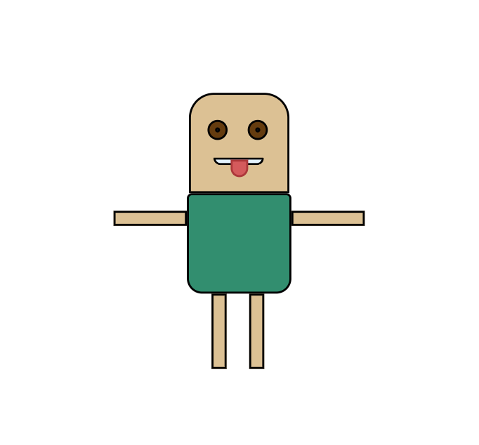

# Draw-with-code

### This is my first project with CSS.
> The project was to create an image using HTML and CSS.

> Practicing how to use the CSS.

> Combining all those together with my creativity.

***

### My Project

> My project is a 2D Rectangle Character.

***

### Technologies Used

> HTML5 | CSS3

### Live Demo
> [Watch the image](https://theodor-gif.github.io/Draw-with-code/)

***

